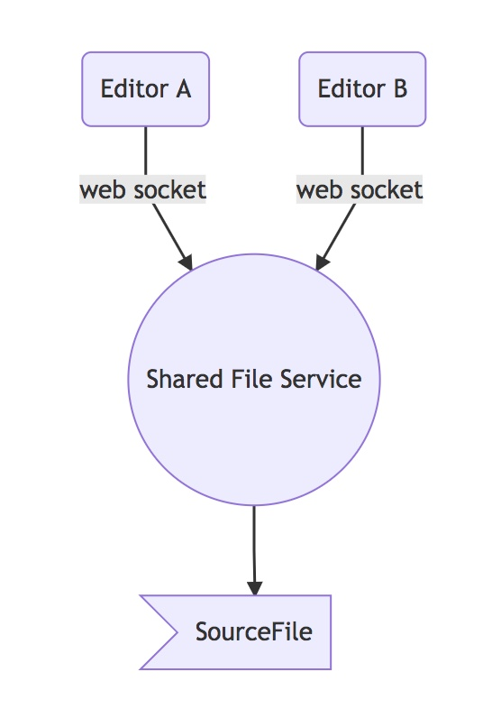

# Pair Programming Service

```
 ___      _       ___                                    _           
| _ \__ _(_)_ _  | _ \_ _ ___  __ _ _ _ __ _ _ __  _ __ (_)_ _  __ _ 
|  _/ _` | | '_| |  _/ '_/ _ \/ _` | '_/ _` | '  \| '  \| | ' \/ _` |
|_| \__,_|_|_|   |_| |_| \___/\__, |_| \__,_|_|_|_|_|_|_|_|_||_\__, |
                              |___/                            |___/ 
```

## Overview

Create an environment where two or more coders can work on the same files.  Private server based, Ace editor, websockets to sync files.


### Block Diagram

## Service Diagram



## Keeping Documents in Sync

Pair documents are kept in sync through web sockets.  There is an event listener attached to the editor that sends each change delta to the recipient.  The recipient then applies this delta (or a set of deltas) through the document API, `doc.appyDelta(delta)` or `doc.applyDeltas([ delta1, delta2 ])`.  Documents can be fully refreshed by clicking on the refresh button.

## References

* Ace editor [documentation](https://ace.c9.io/#nav=api&api=document)
* Ace editor [how to](https://ace.c9.io/#nav=howto)
* Web Sockets [api](https://github.com/gorilla/websocket)

###### darryl.west | 2018.04.09

