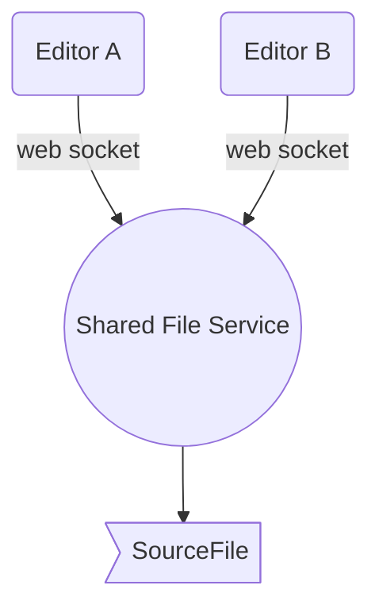

# Pair Programming Service

## Overview

Create an environment whre two or more coders can work on the same files.  Private server based, Ace editor, websockets to sync files.

### Block Diagram

###### darryl.west | 2018.04.02

